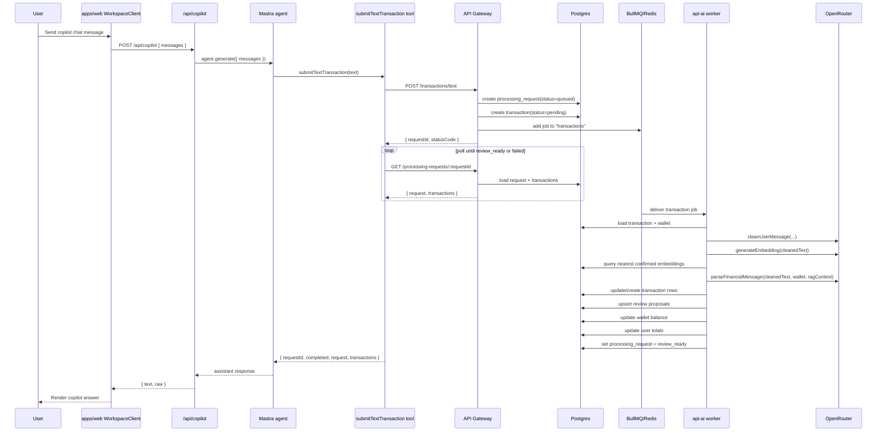
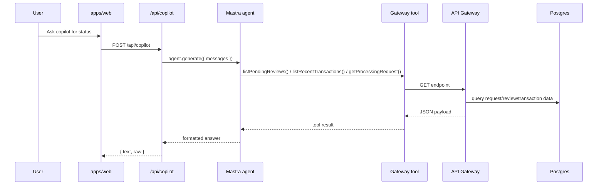
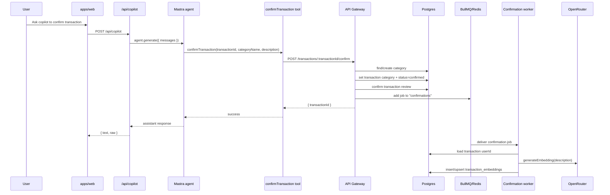

# Mastra Workflow In This Project

This document describes how `Mastra` works in this repo, including the full call chain between the web app, the Mastra agent, the API gateway, the AI worker, and the confirmation loop.

## 1. What Mastra Actually Owns

Mastra is the copilot/orchestration layer, not the core transaction-processing engine.

It is responsible for:

- receiving chat-style copilot requests from `apps/web`
- running the `neoxiReviewAgent`
- deciding which tool to call
- calling existing API gateway endpoints
- returning a concise assistant response back to the web app

It is **not** responsible for:

- parsing uploaded files
- creating DB records directly
- queue processing
- LLM transaction extraction/classification in the worker
- confirmation embedding persistence

Those parts are handled by `apps/api-gateway` and `apps/api-ai`.

## 2. Main Runtime Pieces

- `apps/web/app/workspace-client.tsx`
  Frontend UI for direct submission, review, confirmation, and copilot chat.
- `apps/web/app/api/copilot/route.ts`
  Next.js server route that forwards chat messages to Mastra.
- `apps/mastra/src/mastra/index.ts`
  Defines the `neoxiReviewAgent` and registers tools.
- `apps/mastra/src/mastra/tools/gateway-tools.ts`
  Mastra tools that call the API gateway over HTTP.
- `apps/api-gateway/src/gateway/workspace/workspace.controller.ts`
  Gateway HTTP endpoints used by the UI and by Mastra tools.
- `apps/api-gateway/src/gateway/file-processor/file-processor.service.ts`
  Creates processing requests, creates pending transaction rows, and enqueues jobs.
- `apps/api-ai/src/queue-processor/queue.processor.ts`
  BullMQ consumer for transaction processing.
- `apps/api-ai/src/ai-processor/ai-processor.service.ts`
  Runs the real extraction/classification flow.
- `apps/api-gateway/src/gateway/confirmation/confirmation.service.ts`
  Confirms reviewed transactions and enqueues embedding jobs.
- `apps/api-ai/src/confirmation-processor/confirmation.processor.ts`
  Stores embeddings from confirmed user decisions.

## 3. Mastra Entry Flow

### Call path

1. User types into the copilot chat in `WorkspaceClient`.
2. Frontend calls `POST /api/copilot` in `apps/web`.
3. `apps/web/app/api/copilot/route.ts` creates `MastraClient`.
4. That route gets agent `neoxiReviewAgent`.
5. It calls `agent.generate({ messages })`.
6. Mastra runs the agent instructions from `apps/mastra/src/mastra/index.ts`.
7. If the prompt requires state or an action, the agent invokes one of the registered tools.
8. Each tool calls the API gateway with `fetch(...)`.
9. Tool output is returned to the agent.
10. Agent produces the final natural-language reply.
11. `/api/copilot` returns `{ text, raw }` to the frontend.
12. Frontend appends the assistant message to the chat log.

### Registered agent tools

The `neoxiReviewAgent` has these tools:

- `submitTextTransaction`
- `getProcessingRequest`
- `listPendingReviews`
- `listRecentTransactions`
- `confirmTransaction`

These are thin wrappers around gateway HTTP endpoints.

## 4. Tool-to-Endpoint Mapping

| Mastra tool | HTTP call | Gateway handler | Purpose |
| --- | --- | --- | --- |
| `submitTextTransaction` | `POST /transactions/text` | `WorkspaceController.submitText()` | Submit raw text, then poll until ready/failed |
| `getProcessingRequest` | `GET /processing-requests/:requestId` | `WorkspaceController.getProcessingRequest()` | Load one request and related transactions |
| `listPendingReviews` | `GET /transactions/review-queue` | `WorkspaceController.reviewQueue()` | Show transactions waiting for confirmation |
| `listRecentTransactions` | `GET /transactions/recent` | `WorkspaceController.recent()` | Show recent processed transactions |
| `confirmTransaction` | `POST /transactions/:transactionId/confirm` | `ConfirmationController.confirm()` | Finalize category/description and trigger embedding |

## 5. Full Copilot Submit Flow

This is the path when the user asks the copilot something like:

`Submit this text: I got paid $2200 and spent $48 on groceries`

### Sequence

### Concrete calls inside this flow

#### A. Web to Mastra

- `WorkspaceClient.handleCopilotSubmit()`
- `fetch("/api/copilot", { method: "POST", body: JSON.stringify({ messages }) })`

#### B. Next.js route to Mastra server

- `new MastraClient({ baseUrl: MASTRA_BASE_URL || http://127.0.0.1:${MASTRA_PORT || 4111} })`
- `client.getAgent("neoxiReviewAgent")`
- `agent.generate({ messages })`

#### C. Mastra tool to gateway

`submitTextTransactionTool.execute()`:

- `POST /transactions/text`
- then poll `GET /processing-requests/:requestId`
- stop when `statusCode === "review_ready"` or `statusCode === "failed"`

#### D. Gateway request creation

`FileProcessorService.processText()` delegates to `createAndQueueSubmission()`:

- create `processing_requests` row with status `queued`
- create first `transactions` row with status `pending`
- enqueue BullMQ job on `"transactions"`

#### E. AI worker processing

`QueueProcessor.process()` calls:

- `AiProcessorService.process(transactionId)`

Inside `AiProcessorService.process()`:

1. load transaction and wallet
2. set request status to `processing`
3. `LlmService.cleanUserMessage(rawContent)`
4. `LlmService.generateEmbedding(cleanedText)`
5. query `transactionEmbeddings` for top similar confirmed examples
6. `LlmService.parseFinancialMessage(cleanedText, walletBalance, currency, ragContext)`
7. update existing transaction for first event
8. create more transactions for additional parsed events
9. upsert `transaction_reviews` proposals
10. update wallet balance
11. update user totals
12. set request status to `review_ready`

## 6. Review Lookup Flow

This is the path when the user asks the copilot:

- `What is waiting for review?`
- `Show recent transactions`
- `Check request <id>`

### Sequence

### Gateway query methods behind those tools

- `WorkspaceService.listPendingReviews(userId)`
- `WorkspaceService.listRecentTransactions(userId)`
- `WorkspaceService.getProcessingRequestDetail(requestId)`

## 7. Confirmation Flow Through Mastra

This is the path when the user tells the copilot to finalize a transaction with a corrected category and description.

Example:

`Confirm transaction tx_123 as groceries with description Weekly supermarket run`

### Sequence

### Concrete service calls

`ConfirmationService.confirm()`:

1. validate `categoryName` and `description`
2. load transaction
3. find or create category by name
4. set transaction category and status `confirmed`
5. mark review as confirmed
6. enqueue embedding job on `"confirmations"`

`ConfirmationProcessor.process()`:

1. load transaction owner
2. generate embedding from confirmed description
3. insert or update `transactionEmbeddings`

That embedding becomes future RAG context for new transaction parsing.

## 8. Important Detail: Mastra Polls, The UI Streams

The repo has two different “wait for result” patterns:

- `Mastra` uses polling:
  `submitTextTransactionTool` repeatedly calls `GET /processing-requests/:requestId`.
- `WorkspaceClient` uses server-sent events for the non-copilot UI:
  `EventSource("${gatewayBaseUrl}/processing-requests/${currentRequestId}/events")`

So:

- copilot flow = synchronous-feeling tool call with polling
- workspace request panel = live SSE updates

## 9. Important Detail: There Are Two User Paths

### Direct workspace path

The user can bypass Mastra completely:

- submit text directly to gateway
- upload `.txt`/`.csv`
- confirm transactions directly from the UI

That path uses:

- `POST /transactions/text`
- `POST /transactions/upload`
- `GET /processing-requests/:requestId`
- `GET /transactions/review-queue`
- `GET /transactions/recent`
- `POST /transactions/:transactionId/confirm`

### Copilot path

The user can ask the Mastra agent to do the same operational actions through chat.

That path uses:

- `POST /api/copilot`
- Mastra agent
- Mastra tools
- the same gateway endpoints underneath

Mastra is therefore a second interface over the same backend workflow, not a separate backend workflow.

## 10. Exact Responsibility Split

### `apps/web`

- owns UI state
- owns chat history
- calls `/api/copilot`
- also calls gateway directly for non-copilot actions

### `apps/mastra`

- owns agent instructions
- chooses tools
- converts user chat into gateway actions

### `apps/api-gateway`

- owns HTTP API
- owns request creation
- owns upload parsing
- owns review/recent request aggregation
- owns confirmation endpoint
- owns queue publishing

### `apps/api-ai`

- owns transaction extraction/classification
- owns embedding generation
- owns RAG lookup
- owns review proposal creation
- owns post-confirmation learning loop

## 11. Short End-to-End Summary

The full Mastra workflow in this repo is:

1. `apps/web` sends copilot chat messages to `/api/copilot`.
2. `/api/copilot` calls `neoxiReviewAgent` through `MastraClient`.
3. The Mastra agent chooses a gateway-backed tool.
4. The tool calls the API gateway over HTTP.
5. For submissions, the gateway creates DB records and enqueues BullMQ work.
6. `apps/api-ai` processes the job with OpenRouter-backed LLM and embedding calls.
7. The gateway exposes the request/review state back to Mastra.
8. Mastra turns that state into a concise assistant response.
9. For confirmations, the gateway updates the transaction and queues an embedding job.
10. The confirmation worker stores the confirmed embedding so later requests get better RAG context.
